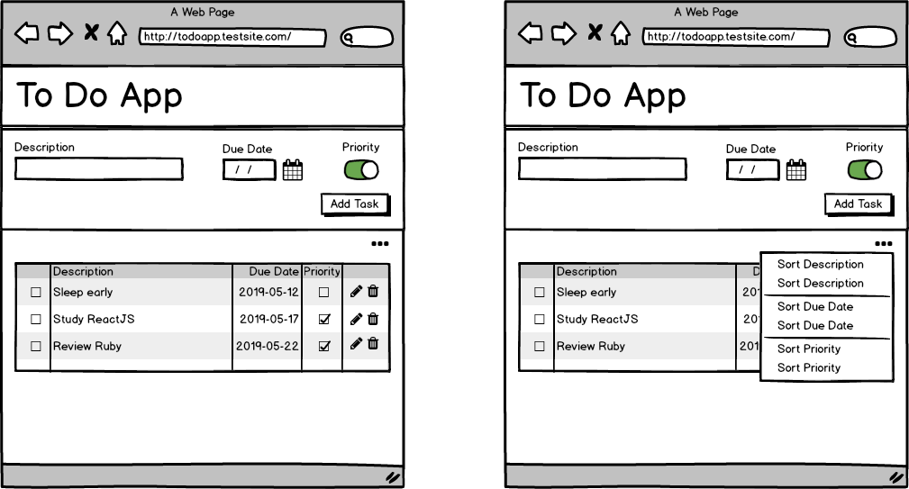

# JavaScript Basics Extended Project

## Group members
- Tech lead: Frank Condezo
- Member 1: Jonathan Mendoza
- Member 2: Paulo Tijero
- Member 3: Angie Gonzales
- Member 4: Carlos Ayala

## Features

- Users can add a task and the due date for the task.
- Users can see the list of tasks.
- Users can mark a task as complete.
- Users can sort the list of tasks in ascending and descending alphabetical order, by due date, by creation date, and as optional by priority first.
- Users can mark a task as a priority task.

## Proposed Design

